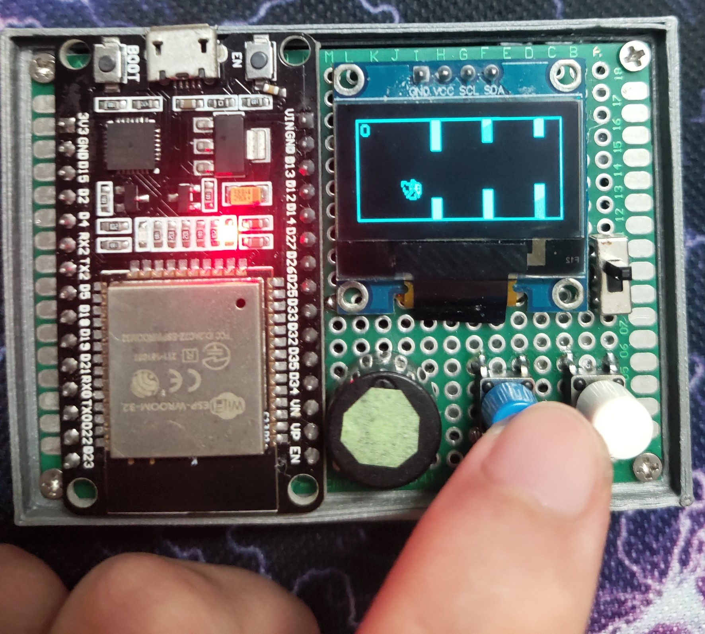
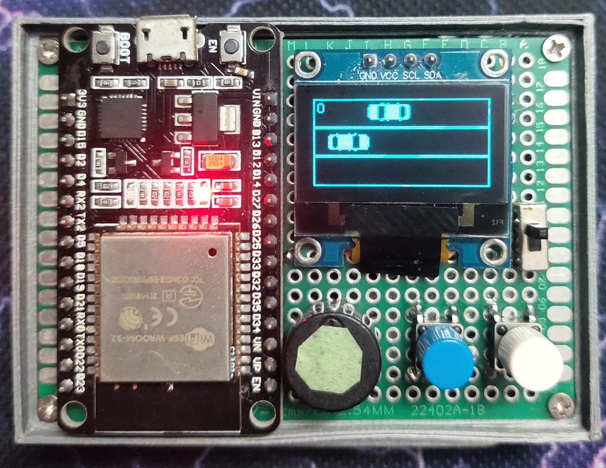
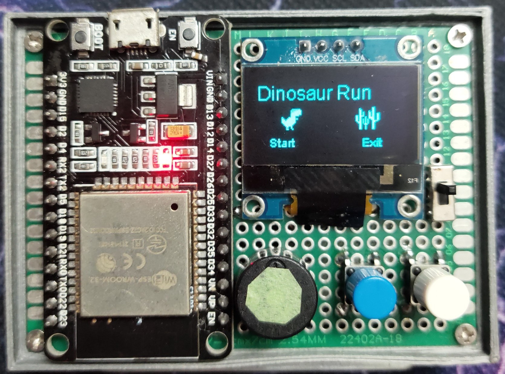

# Bảng trò chơi trên Arduino ESP32

## A. Giới thiệu

- Bảng trò chơi được thiết kế với một menu, màn hình bắt đầu, màn chơi chính và màn hình khi kết thúc game.
- Có 4 game là: Flappy Bird, Catch the Fruits, Racing Car và Dinosaur Run.
- Để chơi game, người chơi làm theo hướng dẫn ở mục B.

## Dependencies

- [ThingPulse OLED SSD1306](https://github.com/ThingPulse/esp8266-oled-ssd1306.git): Thư viện màn hình OLED SSD1306 cho ESP8266 và ESP32.
- [Preferences](https://github.com/vshymanskyy/Preferences): Thư viện lưu trữ điểm cao trong hệ thống tệp flash nội bộ của ESP32.

## Cài đặt

1. Clone repository:

```bash
git clone https://github.com/dang1407/ESP32_GAME.git
```

1. Checkout sang nhánh **menu_game**
1. Mở dự án trong Arduino IDE.

1. Cài đặt các thư viện cần thiết bằng Trình quản lý thư viện Arduino.

1. Cấu hình dự án bằng cách chọn bo mạch và cổng thích hợp.

1. Nạp code vào ESP32 của bạn.

## B. Hướng dẫn chơi

### Video giới thiệu

[YouTube: Demo game ESP32](https://youtu.be/vn7H8XjG3O8)

### 1. Hướng dẫn chung

- Game thủ sử dụng 2 nút (trái và phải) để chọn game và chơi.
- Trong menu, nút bên trái dùng để chuyển sang trò chơi tiếp theo và nút bên phải để chọn trò chơi. Game đang được chọn là game có tên to hơn các game khác.
- Trong màn hình bắt đầu bạn nhấn nút bên trái để bắt đầu trò chơi hoặc nhấn nút bên phải để quay lại menu.
- Trong màn hình chơi chính, nút bên trái dùng để di chuyển nhân vật sang trái hoặc lên và nút bên phải thì ngược lại.
- Tốc độ của nhân vật được tăng lên mỗi khi số điểm chia hết cho 10.
- Điểm của người chơi sẽ được tổng kết ở màn hình kết thúc. Ở đây bạn có thể bấm nút bên phải để quay lại màn hình bắt đầu.
- **Hướng dẫn chung:**

  1.  Bật ESP32 của bạn với game mà bạn muốn chơi.

  2.  Điều khiển nhân vật bằng các nút hoặc cảm biến được chỉ định.

  3.  Cố gắng di chuyển và ghi càng nhiều điểm càng tốt.

  4.  Cạnh tranh với bạn bè và đồng nghiệp để đạt điểm cao nhất!

### 2. Flappy Bird

- Menu
  
- Trong game Flappy Bird, cách chơi giống hệt game nguyên tác của tác giả Dong Nguyen, bạn nhấn nút trái để chú chim bay lên vượt chướng ngại vật.
- Màn chơi chính:
  
- Mỗi khi vượt qua một chướng ngại vật, người chơi sẽ đạt được một điểm.

### 3. Racing Car

- Màn hình bắt đầu

  

- Trong game Racing Car, bạn lái xe của mình trên con đường có 3 làn và phải né tránh các xe đi ngược chiều.
  
- Đôi lúc sẽ có cả 3 xe đi cùng nhau ở 3 làn đường, bạn không thể né tránh và phải sử dụng đạn để tiêu diệt xe ở làn nào đó để đi qua.
- Để bắn đạn thì có 2 cách:
  - Cách 1: Bấm cùng lúc 2 nút bấm, việc này có tỉ lệ cao khiến ô tô của bạn dịch sang hàng khác sau đó quay lại rồi mới bắn đạn. Bạn cần cân nhắc khi sử dụng tính năng này.
  - Cách 2: Bấm vào chân D4 trên ESP32 để bắn đạn nhưng cảm biến đôi lúc có thể không nhạy bén nên bạn cần bấm nhiều lần.
- Mỗi khi vượt qua và có một chiếc ô tô ra khỏi màn chơi, người chơi sẽ được cộng một điểm.

### 4. Catch the Fruits

- Menu
  
- Có thể nói tựa game Catch the Fruits là tựa game dễ nhất, giải trí nhất trong những game mà chúng tôi có.
- Bạn sử dụng nút bấm để di chuyển giỏ hoa quả, nút bấm bên trái để di chuyển sang trái, nút bên phải để di chuyển sang phải, hứng càng nhiều hoa quả càng tốt đồng thời cần né tránh các viên đá.
  
- Mỗi khi hứng được một hoa quả người chơi sẽ được cộng một điểm, khi chạm vào viên đá thì trò chơi sẽ kết thúc.

### 5. Dinosaur Run

- Menu
  
- Tựa game Dinosaur Run có kịch bản tương tự với game xuất hiện trên trình duyệt Chrome khi không có Internet (thường được gọi với cái tên thân thương "Khủng long mất mạng").
  
- Người chơi sử dụng nút bấm bên trái để làm chú khủng long nhảy lên.

## C. Yêu cầu phần cứng

- 1 ESP32 Dev kit
- 1 Màn hình Oled SSD1306 tương thích với ESP32.
- 2 nút bấm
- 1 còi
- 1 Pin 411136 3.7 V và 1 mạch sạc.
- Dây dẫn
- 1 Bảng mạch PCB đục lỗ 5 x 7cm

## D. Sơ đồ nguyên lý


## E. Thiết kế phần mềm

1. Trạng thái nút bấm được xác định thông qua đọc giá trị GPIO của BUTTON_PIN.

### Catch the Fruits:

#### Trạng thái nút bấm:

- Trạng thái của các nút bấm được xác định qua GPIO 23 (BLUE_BUTTON_PIN) và GPIO 33 (WHITE_BUTTON_PIN).

#### Trạng thái của giỏ:

- Vị trí của giỏ được xác định qua biến basketColumn (cột của giỏ).
- Vị trí của giỏ trên trục X được tính toán dựa trên basketColumn và chiều rộng của màn hình.

#### Khởi tạo trò chơi:

- Khi trạng thái nút bấm BLUE_BUTTON_PIN là LOW và millis() hiện tại trừ lastBlueButtonPressTime lớn hơn DEBOUNCE_DELAY, trò chơi bắt đầu.
- Giỏ được đặt vào vị trí cột ban đầu (basketColumn = 1).
- Các loại trái cây được khởi tạo ngẫu nhiên và vị trí của chúng được đặt trên đầu màn hình.

#### Điều khiển giỏ:

- Khi trạng thái nút bấm BLUE_BUTTON_PIN là LOW và millis() hiện tại trừ lastBlueButtonPressTime lớn hơn DEBOUNCE_DELAY, giỏ di chuyển sang trái (giảm giá trị basketColumn).
- Khi trạng thái nút bấm WHITE_BUTTON_PIN là LOW và millis() hiện tại trừ lastWhiteButtonPressTime lớn hơn DEBOUNCE_DELAY, giỏ di chuyển sang phải (tăng giá trị basketColumn).
- Giỏ không thể di chuyển ra khỏi giới hạn của màn hình.

#### Hiển thị và di chuyển trái cây:

- Có 4 cột trái cây, mỗi cột có một loại trái cây hoặc đá ngẫu nhiên được lưu trong mảng fruitType[].
- Các loại trái cây và đá di chuyển từ trên xuống dưới với tốc độ được xác định trong biến speed.
- Khi một loại trái cây ra khỏi màn hình, vị trí của nó được đặt lại ở trên đầu màn hình và loại của nó được khởi tạo lại ngẫu nhiên.

#### Kiểm tra va chạm:

- Kiểm tra xem vùng hiển thị của giỏ có chồng lên vùng hiển thị của trái cây hoặc đá hay không.
- Nếu giỏ chồng lên một trái cây, điểm số được tăng lên và vị trí trái cây đó được đặt lại ở trên đầu màn hình.
- Nếu giỏ chồng lên một đá, trò chơi kết thúc.

#### Tăng tốc độ:

- Mỗi khi người chơi tăng 10 điểm, tốc độ di chuyển của các loại trái cây và đá sẽ tăng lên.

#### Kết thúc trò chơi:

- Khi trò chơi kết thúc, nếu điểm số hiện tại cao hơn điểm số cao nhất (highScore), highScore được cập nhật và lưu vào bộ nhớ flash.
- Hiển thị điểm số hiện tại và điểm số cao nhất.
- Người chơi có thể bắt đầu lại trò chơi bằng cách nhấn BLUE_BUTTON_PIN hoặc reset điểm số cao nhất bằng cách nhấn BOOT_BUTTON_PIN.

### Flappy Bird:

Logic Thiết Kế Phần Mềm Flappy Bird:

#### Trạng thái nút bấm:

- Trạng thái của nút bấm được xác định qua GPIO 23 (BLUE_BUTTON_PIN).
- Khi trạng thái nút bấm là LOW, chim sẽ bay lên.

#### Trạng thái của chim:

- Vị trí của chim được xác định qua hai biến playerX và playerY.
- Trạng thái bay lên của chim được xác định qua biến isFlyingUp.

#### Khởi tạo trò chơi:

- Khi nút BLUE_BUTTON_PIN được nhấn và gameState là 0, trò chơi bắt đầu.
- Chim được đặt vào vị trí ban đầu (playerX, playerY).
- Các ống được khởi tạo ngẫu nhiên và vị trí của chúng được đặt ở phía bên phải màn hình.

#### Điều khiển chim:

- Khi nút BLUE_BUTTON_PIN được nhấn, chim bay lên (giảm playerY).
- Nếu không nhấn nút, chim sẽ rơi xuống (tăng playerY).

#### Hiển thị và di chuyển các ống:

- Có 4 ống, mỗi ống có chiều cao ngẫu nhiên được lưu trong mảng bottomTubeHeight[].
- Các ống di chuyển từ phải qua trái với tốc độ được xác định trong biến speed.
- Khi một ống ra khỏi màn hình, vị trí của nó được đặt lại ở phía bên phải màn hình và chiều cao của nó được khởi tạo lại ngẫu nhiên.

#### Kiểm tra va chạm:

- Kiểm tra xem vùng hiển thị của chim có chồng lên vùng hiển thị của ống hay không.
- Nếu chồng lên, trò chơi kết thúc.
- Kiểm tra xem chim có chạm vào biên của màn hình hay không. Nếu có, trò chơi kết thúc.

#### Tăng tốc độ:

- Mỗi khi người chơi đạt được 10 điểm, tốc độ di chuyển của các ống sẽ tăng lên.

#### Kết thúc trò chơi:

- Khi trò chơi kết thúc, nếu điểm số hiện tại cao hơn điểm số cao nhất (highScore), highScore được cập nhật và lưu vào bộ nhớ flash.
- Hiển thị điểm số hiện tại và điểm số cao nhất.
- Người chơi có thể bắt đầu lại trò chơi bằng cách nhấn BLUE_BUTTON_PIN hoặc reset điểm số cao nhất bằng cách nhấn BOOT_BUTTON_PIN.

### Racing car:

#### Trạng thái nút bấm:

- Trạng thái của các nút bấm được xác định qua GPIO 23 (BLUE_BUTTON_PIN) và GPIO 33 (WHITE_BUTTON_PIN).

#### Trạng thái của xe:

- Vị trí của xe người chơi được xác định qua biến carRow (hàng của xe).
- Vị trí của xe trên trục Y được tính toán dựa trên carRow và chiều cao của màn hình.
- Xe người chơi có thể bắn đạn khi cả hai nút BLUE_BUTTON_PIN và WHITE_BUTTON_PIN được nhấn cùng lúc và điểm số hiện tại lớn hơn hoặc bằng 3.

#### Khởi tạo trò chơi:

- Khi nút BLUE_BUTTON_PIN được nhấn và millis() hiện tại trừ lastBlueButtonPressTime lớn hơn DEBOUNCE_DELAY, trò chơi bắt đầu.
- Xe người chơi được đặt vào vị trí hàng ban đầu (carRow = 1).
- Các xe chướng ngại vật được khởi tạo ngẫu nhiên và vị trí của chúng được đặt ở phía bên phải màn hình.

#### Điều khiển xe:

- Khi nút BLUE_BUTTON_PIN được nhấn, xe di chuyển lên trên (giảm giá trị carRow).
- Khi nút WHITE_BUTTON_PIN được nhấn, xe di chuyển xuống dưới (tăng giá trị carRow).
- Xe không thể di chuyển ra khỏi giới hạn của màn hình.

#### Hiển thị và di chuyển xe chướng ngại vật:

- Có 3 hàng xe chướng ngại vật, mỗi hàng có một vị trí ngẫu nhiên được lưu trong mảng obstacleCarsX[].
- Các xe chướng ngại vật di chuyển từ phải qua trái với tốc độ được xác định trong biến speed.
- Khi một xe chướng ngại vật ra khỏi màn hình, vị trí của nó được đặt lại ở phía bên phải màn hình và vị trí của nó được khởi tạo lại ngẫu nhiên.

#### Kiểm tra va chạm:

- Kiểm tra xem vùng hiển thị của xe người chơi có chồng lên vùng hiển thị của xe chướng ngại vật hay không.
- Nếu chồng lên, trò chơi kết thúc.

#### Tăng tốc độ:

- Mỗi khi người chơi đạt được 10 điểm, tốc độ di chuyển của các xe chướng ngại vật sẽ tăng lên.

#### Kết thúc trò chơi:

- Khi trò chơi kết thúc, nếu điểm số hiện tại cao hơn điểm số cao nhất (highScore), highScore được cập nhật và lưu vào bộ nhớ flash.
- Hiển thị điểm số hiện tại và điểm số cao nhất.
- Người chơi có thể bắt đầu lại trò chơi bằng cách nhấn BLUE_BUTTON_PIN hoặc reset điểm số cao nhất bằng cách nhấn BOOT_BUTTON_PIN.

### Dinosaur run

- Trạng thái nút bấm được xác định qua GPIO 23.
- Trạng thái khủng long được xác định qua 2 biến **_isJumping_** và **_isFalling_**.
- Khi trạng thái nút bấm là LOW và khủng long không ở trạng thái đang nhảy (**_isJumping = false_**) cũng như trạng thái đang rơi (**_isFalling = false_**), khủng long nhảy lên cao đến mức 6 điểm ảnh trên màn hình OLED.
- Khi nhảy đến điểm cao nhất khủng long sẽ tạm dừng ở đó 1 khoảng thời gian được khai báo trong biến **_dinoTopDelay_** (đơn vị là milisecond). Sau đó khủng long sẽ rơi xuống đến tọa độ của mặt đất.
- Tốc độ nhảy lên và rơi xuống của khủng long lần lượt là **_speedUp_** và **_speedDown_**. Tốc độ này sẽ thay đổi theo từng khoảng trong quá trình nhảy lên và rơi xuống để tạo cảm giác mượt hơn. Tương ứng với từng khoảng, giá trị tốc độ được lưu trong mảng **_speedUpArray[]_** và **_speedDownArray[]_**.
- Có 3 loại cây xương rồng được random hiển thị và lưu trong mảng **_cactusDisplay[3]_** - tại 1 thời điểm có tối đa 3 cây xương rồng trên màn hình. Khi một cây xương rồng ra khỏi màn chơi thì giá trị hiển thị sẽ được random lại và tọa độ X của cây xương rồng đó sẽ được dịch sang phải, tọa độ này sẽ được tính toán cách 1 khoảng thích hợp so với cây xương rồng cuối cùng đang được hiển thị.
- Cây xương rồng và mặt đất sẽ di chuyển từ phải qua trái với giá trị tốc độ được khai báo trong biến **_speed_**. Mỗi khi người chơi tăng 10 điểm tốc độ này sẽ tăng lên.
- Kiểm tra va chạm: Kiểm tra xem vùng hiển thị của khủng long có chồng lên vùng hiển thị của cây xương rồng hay không. Nếu chồng lên thì trò chơi kết thúc.

## F. Tác giả

Project này được phát triển dựa trên dự án Flappy bird của tác giả https://github.com/nonameex1sts/FlappyBird_ESP32

- Nguyễn Khánh Minh Đăng: 20204720
- Nguyễn Văn Thành: 20204789
- Bùi Việt Anh: 20204709
- Trần Trung Kiên: 20200304
